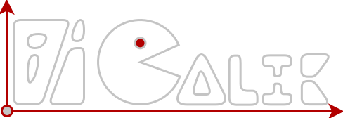
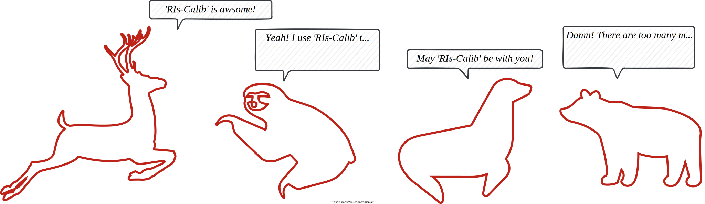
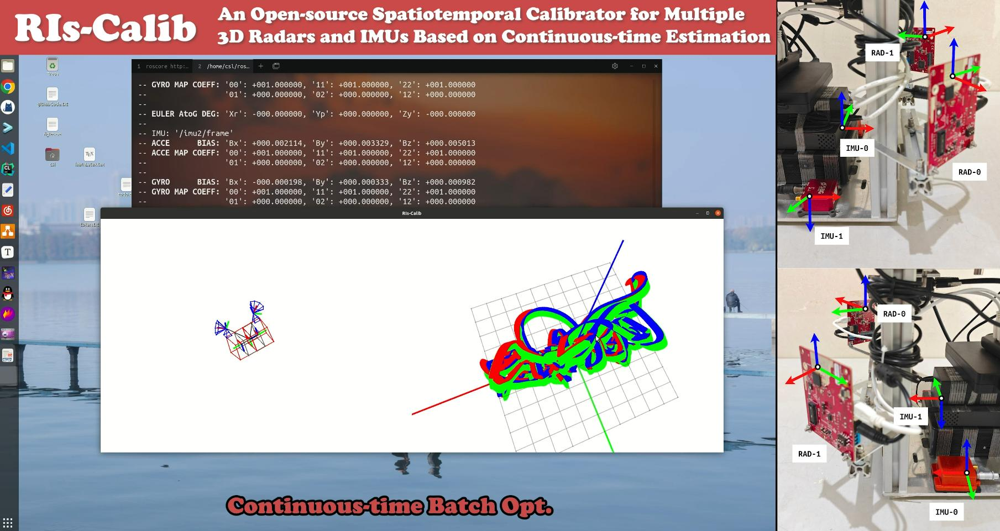

# RIs-Calib: Multi-Radar Multi-IMU Spatiotemporal Calibrator

           

<div align=center></div>

## 0. Preliminaries

If you use ***RIs-Calib*** in a scientific publication, please cite the following  paper :smile::

```latex
# todo...
```

## 1. Overview

<div align=center></div>

Aided inertial navigation system (INS), typically consisting of an inertial measurement unit (IMU) and an exteroceptive sensor, has been widely accepted and applied as a feasible solution for navigation. Compared with other aided INS, such as vision-aided INS and LiDAR-aided INS, radar-aided INS has better performance in adverse weather conditions such as fog and rain, due to the low-frequency signals radar utilizes. For such a radar-aided INS, accurate spatiotemporal transformation is a fundamental prerequisite to achieving optimal information fusion. In this paper, we present `RIs-Calib`: a spatiotemporal calibrator for multiple 3D radars and IMUs based on continuous-time estimation, which enables accurate spatial, temporal, and intrinsic calibration, and does not require any additional artificial infrastructure or prior knowledge. Our approach starts with a rigorous and robust procedure for state initialization, followed by batch optimizations, where all parameters can be refined to global optimal states steadily. We validate and evaluate `RIs-Calib` on both simulated and real-world experiments, and the results demonstrate that `RIs-Calib` is capable of accurate and consistent calibration. We open-source our implementations at (**https://github.com/Unsigned-Long/RIs-Calib**) to benefit the research community.


<div align='center'><font size='5' color='red'><b><i>Demo Video for RIs-Calib</i></b></font></div>

Our accompanying videos are now available on **YouTube** (click below images to open) and [Bilibili](https://www.bilibili.com/video/BV1pw411y7NR/?vd_source=87245258ec5029cca67d77cef1a6201d).

[](https://youtu.be/CoOjn-9c4Dc)

## 2. Build RIs-Calib

### 2.1 Preparation

+ install `ROS1` (Ubuntu **20.04** is suggested, Ubuntu **18.04** (ros melodic) is also available):

  ```bash
  sudo apt install ros-noetic-desktop-full
  echo "source /opt/ros/noetic/setup.bash" >> ~/.bashrc
  source ~/.bashrc
  ```

  **Requirements: ROS1 & C++17 Support**

+ install `Ceres`:

  see the `GitHub` Profile of **[Ceres](https://github.com/ceres-solver/ceres-solver.git)** library, clone it, compile it, and install it. **Make sure that the version of `Ceres` contains the `Manifold` module. (`Ceres` version equal to 2.2.0 or higher than that)**

+ install `Sophus`:

  see the `GitHub` Profile of **[Sophus](https://github.com/strasdat/Sophus.git)** library, clone it, compile it, and install it.

+ install `magic-enum`:

  see the `GitHub` Profile of **[magic-enum](https://github.com/Neargye/magic_enum.git)** library, clone it, compile it, and install it.

+ install `Pangolin`:

  see the `GitHub` Profile of **[Pangolin](https://github.com/stevenlovegrove/Pangolin.git)** library, clone it, compile it, and install it.

+ install `spdlog`:

  see the `GitHub` Profile of **[spdlog](https://github.com/gabime/spdlog.git)** library, clone it, compile it, and install it.

+ install `fmt`, `Cereal`, `spdlog`, `yaml-cpp`:

  ```bash
  sudo apt-get install libfmt-dev
  sudo apt-get install libcereal-dev
  sudo apt-get install libyaml-cpp-dev
  ```


### 2.2 Clone and Compile RIs-Calib

+ create a ros workspace if needed and clone `RIs-Calib` to `src` directory as `ris_calib`:

  ```bash
  mkdir -p ~/RIs-Calib/src
  cd ~/RIs-Calib/src
  
  git clone --recursive https://github.com/Unsigned-Long/RIs-Calib.git ris_calib
  ```

  change directory to '`ris_calib`', and run '`build_thirdparty.sh`'.

  ```bash
  cd ris_calib
  chmod +x build_thirdparty.sh
  ./build_thirdparty.sh
  ```

  this would build '`tiny-viewer`' and '`ctraj`' libraries.

+ Prepare for thirdparty ros packages:

  clone ros packages '`ainstein_radar`', '`ti_mmwave_rospkg`', '`serial`', '`sbg_ros_driver`' to '`ris_calib/..`' (directory at the same level as `ris_calib`):

  ```sh
  cd ..
  git clone https://github.com/AinsteinAI/ainstein_radar.git
  git clone https://github.com/Unsigned-Long/ti_mmwave_rospkg.git
  git clone https://github.com/wjwwood/serial.git
  git clone https://github.com/SBG-Systems/sbg_ros_driver.git
  ```

  then change directory to the ros workspace to build these packages:

  ```sh
  cd ..
  catkin_make -DCATKIN_WHITELIST_PACKAGES="ainstein_radar;ti_mmwave_rospkg;serial;sbg_driver"
  ```

  Note that these packages will depend on many other ros packages, you need to install them patiently.

+ compile `RIs-Calib`:

  ```bash
  catkin_make -DCATKIN_WHITELIST_PACKAGES=""
  ```


## 3. Launch RIs-Calib

### 3.1 Simulation Test

[***simulation experiments (datasets, launch, result visualization)***](simu-expr.md)


### 3.2 Real-world Experiments

[***real-world experiments (datasets, launch, result visualization)***](real-world-expr.md)

### 3.3 Skip Tutorial

Find a **configure file** named `config-real-world.yaml` in `/ris_calib/config` **or** from the open-source datasets below:

```txt
# Google Drive
https://drive.google.com/drive/folders/1_SPdmBnWIJTYyOIkyS0StbPMGVLdV_fw?usp=drive_link
```

Then **change the fields** in the configure files to be compatible with your dataset (there are detailed comments for each field). You only need to change a few fields related to io (input and output), perhaps some additional fields related to optimization.

Then **give the path of your configuration file to the launch file** of `RIs-Calib` named `ris-calib-prog.launch` in folder `ris_calib/launch`, Then, we **launch** '`RIs-Calib`':

```sh
roslaunch ris_calib ris-calib-prog.launch
```

The corresponding results would be output to the directory you set in the configure file.


**Attention**: ***Sufficiently excited motion is required for accurate spatiotemporal calibration in `RIs-Calib`!***
