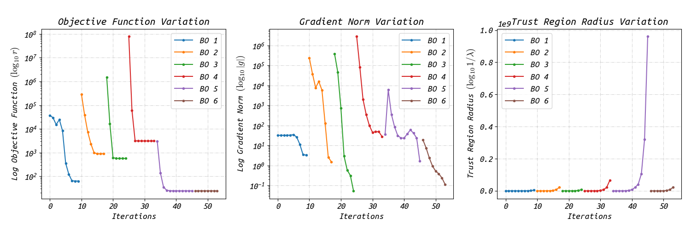
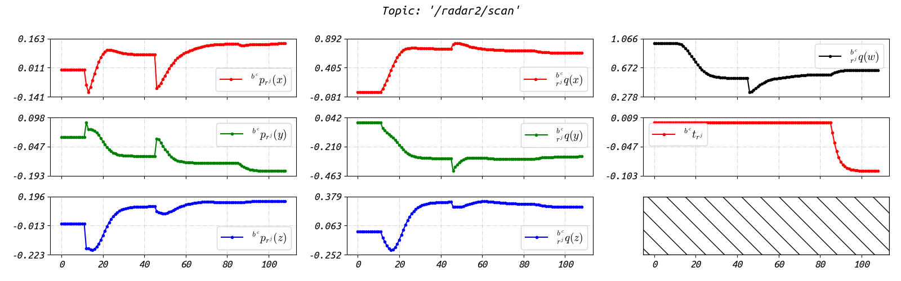

# RIs-Calib: Multi-Radar Multi-IMU Spatiotemporal Calibrator

           

<div align=center></div>


### 3.2 Real-world Experiments

The data of the real-world experiments we conducted are available here:

```latex
# Google Drive
https://drive.google.com/drive/folders/1_SPdmBnWIJTYyOIkyS0StbPMGVLdV_fw?usp=drive_link
```

Each data contains a ros bag, an information file, and a corresponding configuration file for solving:

+ `radars_imus.bag`: the ros bag which contains the measurements of two IMUs and radars, they are:

  ```latex
  path:        radars_imus.bag
  version:     2.0
  duration:    3:26s (206s)
  start:       Sep 26 2023 14:46:05.22 (1695710765.22)
  end:         Sep 26 2023 14:49:31.50 (1695710971.50)
  size:        69.7 MB
  messages:    347984
  compression: none [88/88 chunks]
  types:       sbg_driver/SbgImuData      [59cc541d794c367e71030fa700720826]
               sensor_msgs/Imu            [6a62c6daae103f4ff57a132d6f95cec2]
               ti_mmwave_rospkg/RadarScan [ca47afe7b19c0dbeb8f6b51574599509]
  topics:      /imu1/frame     82507 msgs    : sensor_msgs/Imu           
               /imu2/frame     40424 msgs    : sbg_driver/SbgImuData     
               /radar1/scan   130741 msgs    : ti_mmwave_rospkg/RadarScan
               /radar2/scan    94312 msgs    : ti_mmwave_rospkg/RadarScan
  ```

+ `duration.txt`: the file that records the time duration of the valid data piece (they are excited sufficiently, and thus could be used for calibration).
+ `config-real.yaml`: the corresponding configuration file.

The next steps are simple, just modify the file paths of the ros bag in the configuration file, and then configure the launch file of `RIs-Calib`, i.e., `ris-calib-prog.launch` in the `ris_calib` folder. Then, we launch '`RIs-Calib`':

```sh
roslaunch ris_calib ris-calib-prog.launch
```

You could use scripts in '`ris_calib/scripts`' to draw figures:

<details open>
    <summary><b><i>Distributions of IMU factors (accelerometer factor & gyroscope factor) in batch optimizations</i></b></summary>
    <div align=center></div>
</details>

<details open>
    <summary><b><i>Convergence performance of spatiotemporal parameters for IMUs</i></b></summary>
    <div align=center></div>
</details>

<details open>
    <summary><b><i>Convergence performance of spatiotemporal parameters for Radars</i></b></summary>
    <div align=center></div>
</details>


<details open>
    <summary><b><i>Sensor suites & rotation and velocity B-splines</i></b></summary>
    <div align=center>
        
        
        
        </div>
</details>
