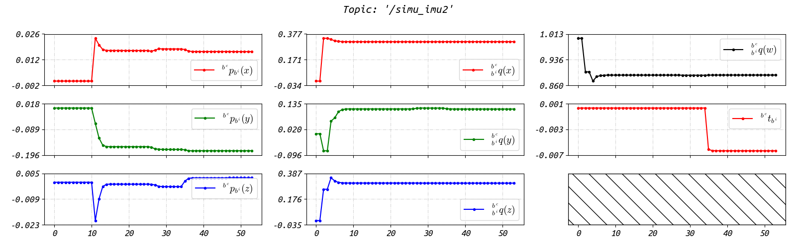
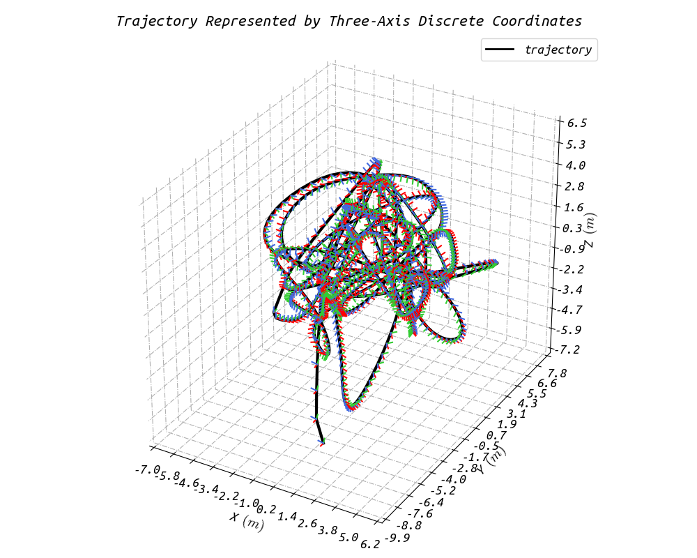

# RIs-Calib: Multi-Radar Multi-IMU Spatiotemporal Calibrator

           

<div align=center></div>

### 3.1 Simulation Test

We provide four simulation experiments, the corresponding data are in the '`ris_calib/output`' folder:

+ '`simu1`' and '`simu2`': one IMU and one radar.
+ '`simu3`' and '`simu4`' three IMUs and three radars.
+ Two scenes are simulated (eight-shape wave motion (left) and random motion (right)):

<div align=center></div>

To perform calibration for dataset '`simu1`' or '`simu2`', you should change field '`config_path`' in '`ris_calib/launch/ris-calib-prog.launch`' to:

```sh
$(find ris_calib)/config/config-simu12.yaml
```

The file '`config-simu12.yaml`' is a configure file for '`RIs-Calib`', which could be found in folder '`/ris_calib/config`'. The detail configure information could determined be by yourself. Then, we launch '`RIs-Calib`' (**before launch `RIs-Calib`, remember change the path or directory in the yaml-format configure file!**):

```sh
roslaunch ris_calib ris-calib-prog.launch
```

The calibration results (left: splines for simu1, middle: splines for simu2, right: sensor suite):

<div align=center></div>

For simu3 and simu4, you should change field '`config_path`' in '`ris_calib/launch/ris-calib-prog.launch`' to:

```sh
$(find ris_calib)/config/config-simu34.yaml
```

Then, we launch '`RIs-Calib`' (**before launch `RIs-Calib`, remember change the path or directory in the yaml-format configure file!**):

```sh
roslaunch ris_calib ris-calib-prog.launch
```

The calibration results (left: splines for `simu3`, middle: splines for `simu4`, right: sensor suite):

<div align=center></div>

You could use scripts in '`ris_calib/scripts`' to draw figures:

<details open>
    <summary><b><i>Distributions of IMU factors (accelerometer factor & gyroscope factor) in batch optimizations</i></b></summary>
    <div align=center></div>
</details>

<details open>
    <summary><b><i>Convergence performance of spatiotemporal parameters for IMUs</i></b></summary>
    <div align=center></div>
</details>

<details open>
    <summary><b><i>Convergence performance of spatiotemporal parameters for Radars</i></b></summary>
    <div align=center></div>
</details>

<details open>
    <summary><b><i>Normal equations built during one iteration</i></b></summary>
    <div align=center>
        <b><i>Control points from rotation and velocity B-splines</i></b>
        <br/>
        
        <br/>
        <b><i>All spatiotemporal parameters</i></b>
        <br/>
        </div>
</details>

<details open>
    <summary><b><i>Rotation and velocity B-splines (left: simu3, right: simu4)</i></b></summary>
    <div align=center>
        
        </div>
</details>
